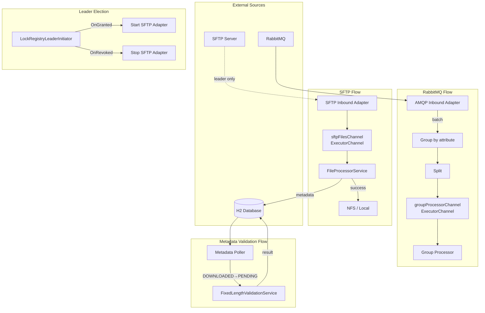

# Spring Integration Sample

Spring Boot application demonstrating Spring Integration patterns: SFTP ingestion, leader election, fixed-length file validation, and RabbitMQ batch consumption.

## Overview



## Adapters & Flows

| Adapter / Flow | Document | Description |
|----------------|----------|-------------|
| SFTP Inbound | [documentations/SFTP-ADAPTER.md](documentations/SFTP-ADAPTER.md) | Leader-only file download from SFTP, parallel local processing |
| RabbitMQ Batch | [documentations/RABBITMQ-ADAPTER.md](documentations/RABBITMQ-ADAPTER.md) | Batch consume, group by attribute, parallel downstream |
| Metadata Validation | [documentations/METADATA-VALIDATION.md](documentations/METADATA-VALIDATION.md) | Poll DB, claim records, validate fixed-length files |

## Channels

| Channel | Type | Purpose |
|---------|------|---------|
| `sftpFilesChannel` | ExecutorChannel | Parallel file processing (multiple workers) |
| `sftpPollerErrorChannel` | DirectChannel | SFTP poller errors → error logging |
| `groupProcessorChannel` | ExecutorChannel | Parallel group processing (RabbitMQ batches) |

See [documentations/CHANNELS.md](documentations/CHANNELS.md) for details.

## Prerequisites

- **H2**: Run `./gradlew :spring-integration-sample:runH2Server` for shared DB (leader election, metadata).
- **RabbitMQ** (optional): Docker Compose or local instance for batch demo.
- **SFTP** (optional): Configure `sftp.*` in `application.yml` for file ingestion.

## Run

```bash
./gradlew :spring-integration-sample:bootRun
```

## Configuration

See `src/main/resources/application.yml` for:

- `sftp.*` – SFTP connection and processing
- `rabbitmq.*` – Queue, batch size, parallelism
- `validation.*` – Poller interval, max per poll
- `leader.*` – Leader election role, heartbeat
